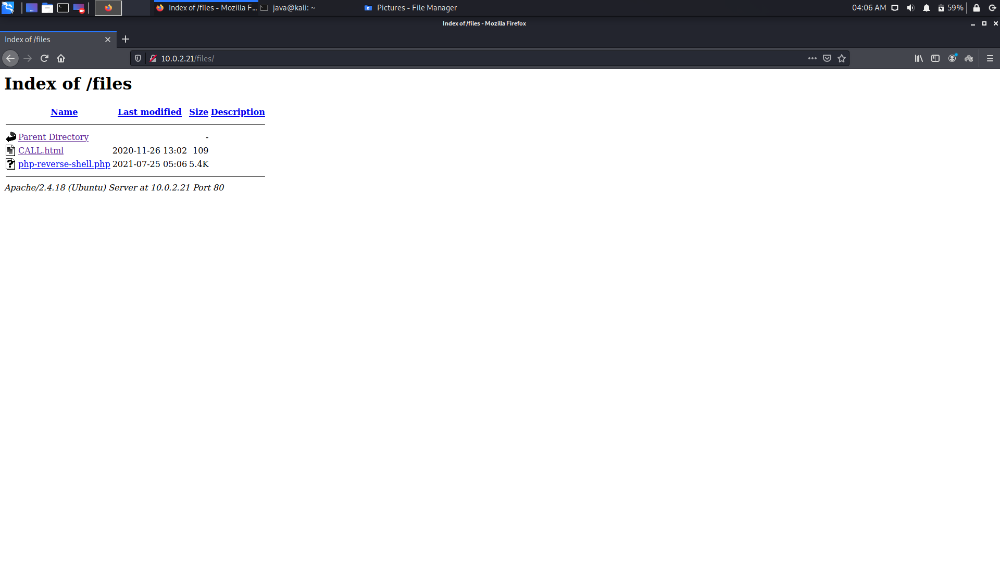

# HackableII
First, we find the IP of our vulnerable machine using nmap.

Then we scan for open ports using nmap

port 80 is open so we check it out in the browser. We don't get anything from the webpage so we start crawling and finding directories of the server using dirbuster

We find /files. There is a file name CALL in that directory. It's a clue and it implicate that we need to setup a listener but first we need to send our payload to the server.

ftp is a good candidate for sending the payload. by connecting to it using ftp we can log in as anonymous user and that's good. We put are reverse shell payload in the server. it gets uploaded to the /files so we can access and run it on the server

but before we run it we set up a listener using netcat. by running the payload on the server we get a shell and we check for permissions and clues

We find a .txt file that says to run the specified program, so we run it.

the program gives us a md5 hash which seems to be the password for user shrek, we crack it and it gives us **onion**. We try to ssh to shrek using the credentials that we have and we get a shell

in the home dir there's a flag

Now we need to escalate our privilages. We check sudoers and we see that shrek can sudo run python3.5, so we open python3.5 and using it we get a shell with root privilages

We go to /root and get the last flag

